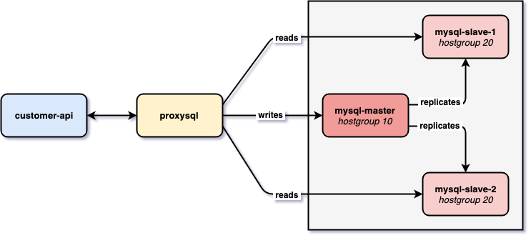

# springboot-proxysql-mysql

The goal of this project is to use [`ProxySQL`](https://proxysql.com/) to load balance requests from a [`Spring Boot`](https://docs.spring.io/spring-boot/docs/current/reference/htmlsingle/) application to [`MySQL`](https://www.mysql.com/) Replication Master-Slave Cluster.

## Project Architecture



## Applications

- ### MySQL

  [`MySQL`](https://www.mysql.com/) is the most popular Open Source SQL database management system, supported by `Oracle`. In this project, we set a **MySQL Replication Master-Slave Cluster** that contains three `MySQL` instances: one master and two slaves. In the replication process, the data is copied automatically from master to the slaves.

- ### ProxySQL

  [`ProxySQL`](https://proxysql.com/) is an open-source, high-performance `MySQL` proxy server. It seats between application and database servers by accepting incoming traffic from `MySQL` clients and forwards it to backend `MySQL` servers. In this project, we set two `hostgroups`: `writer=10` and `reader=20`. Those hostgroups say to which database servers write or read requests should go. The `MySQL` master belongs to the `writer` hostgroup. On the other hand, the slaves belong to `reader` one.

- ### customer-api

  `Spring Boot` Web Java application that exposes a REST API for managing customers. Instead of connecting directly to `MySQL`, as usual, the application will be connected to `ProxySQL`.

  `customer-api` has the following endpoints:
  ```
     GET /api/customers
     GET /api/customers/{id}
    POST /api/customers {"firstName":"...", "lastName":"..."}
     PUT /api/customers/{id} {"firstName":"...", "lastName":"..."}
  DELETE /api/customers/{id}
  ```

## Prerequisites

- [`Java 17+`](https://www.oracle.com/java/technologies/downloads/#java17)
- [`Docker`](https://www.docker.com/)

## Start Environment

- Open a terminal and, inside `springboot-proxysql-mysql` root folder, run the following script
  ```
  ./init-environment.sh
  ```

- Wait until the environment is up and running

## Check MySQL Replication

- In a terminal, make sure you are inside `springboot-proxysql-mysql` root folder

- To check the replication status run
  ```
  ./check-replication-status.sh
  ```

  You should see something like
  ```
  mysql-master
  ------------
  File    Position        Binlog_Do_DB    Binlog_Ignore_DB        Executed_Gtid_Set
  mysql-bin.000003        945                     38f50e33-7fc4-11e9-a810-0242ac1b0003:1-9
  
  mysql-slave-1
  -------------
  *************************** 1. row ***************************
                 Slave_IO_State: Waiting for master to send event
                    Master_Host: mysql-master
                    Master_User: repl
                    Master_Port: 3306
                  Connect_Retry: 60
                Master_Log_File: mysql-bin.000003
            Read_Master_Log_Pos: 945
                 Relay_Log_File: 5c42804f49ab-relay-bin.000003
                  Relay_Log_Pos: 1158
          Relay_Master_Log_File: mysql-bin.000003
               Slave_IO_Running: Yes
              Slave_SQL_Running: Yes
                              ...
  
  mysql-slave-2
  -------------
  *************************** 1. row ***************************
                 Slave_IO_State: Waiting for master to send event
                    Master_Host: mysql-master
                    Master_User: repl
                    Master_Port: 3306
                  Connect_Retry: 60
                Master_Log_File: mysql-bin.000003
            Read_Master_Log_Pos: 945
                 Relay_Log_File: d08e85c4beb8-relay-bin.000003
                  Relay_Log_Pos: 1158
          Relay_Master_Log_File: mysql-bin.000003
               Slave_IO_Running: Yes
              Slave_SQL_Running: Yes
                              ...
  ```

## Check ProxySQL configuration

- In a terminal and inside `springboot-proxysql-mysql` root folder, run the script below to connect to `ProxySQL` command line terminal
  ```
  ./proxysql-admin.sh
  ```

- In `ProxySQL Admin> ` terminal run the following command to see the `MySQL` servers 
  ```
  SELECT * FROM mysql_servers;
  ```

- The following select shows the global variables
  ```
  SELECT * FROM global_variables;
  ```
  
- In order to exit `ProxySQL` command line terminal, type `exit`

## Start customer-api

- Open a new terminal and navigate to `springboot-proxysql-mysql` root folder

- Run the following Maven command to start `customer-api`
  ```
  ./mvnw clean spring-boot:run --projects customer-api
  ```

## Simulation

1. Open three terminals: one for `mysql-master`, one for `mysql-slave-1` and another for `mysql-slave-2`

1. In `mysql-master` terminal, connect to `MySQL Monitor` by running
   ```
   docker exec -it -e MYSQL_PWD=secret mysql-master mysql -uroot --database customerdb
   ```

1. Do the same for `mysql-slave-1`...
   ```
   docker exec -it -e MYSQL_PWD=secret mysql-slave-1 mysql -uroot --database customerdb
   ```

1. ... and `mysql-slave-2`
   ```
   docker exec -it -e MYSQL_PWD=secret mysql-slave-2 mysql -uroot --database customerdb
   ```

1. Inside each one of the `MySQL Monitor's` terminal, run the following commands to enable `MySQL` logs
   ```
   SET GLOBAL general_log = 'ON';
   SET global log_output = 'table';
   ```

1. Open a new terminal. In it, we will just run `curl` commands.

1. In the `curl` terminal, let's create a customer.
   ```
   curl -i -X POST http://localhost:8080/api/customers \
     -H 'Content-Type: application/json' \
     -d '{"firstName": "Ivan", "lastName": "Franchin"}'
   ```
   
1. Go to `mysql-master` terminal and run the following `SELECT` command
   ```
   SELECT event_time, command_type, SUBSTRING(argument,1,250) argument FROM mysql.general_log
   WHERE command_type = 'Query' AND (argument LIKE 'insert into customers %' OR argument LIKE 'select customer0_.id %' OR argument LIKE 'update customers %' OR argument LIKE 'delete from customers %');
   ```

   It should return
   ```
   +----------------------------+--------------+-------------------------------------------------------------------------------------------------------------------------------------------------+
   | event_time                 | command_type | argument                                                                                                                                        |
   +----------------------------+--------------+-------------------------------------------------------------------------------------------------------------------------------------------------+
   | 2020-06-30 08:02:59.981686 | Query        | insert into customers (created_at, first_name, last_name, updated_at) values ('2020-06-30 08:02:59', 'Ivan', 'Franchin', '2020-06-30 08:02:59') |
   +----------------------------+--------------+-------------------------------------------------------------------------------------------------------------------------------------------------+
   ```
   
   > **Note**: If you run the same `SELECT` in the slave's terminal, you will see that just the `mysql-master` processed the `insert` command. Btw, it's in `mysql-master` where all inserts, updates and deletes are executed.

1. Now, let's call to the `GET` endpoint to retrieve `customer 1`. For it, go to `curl` terminal and run
   ```
   curl -i http://localhost:8080/api/customers/1
   ```

1. If you run, in one of the slave's terminal, the `SELECT` command below
   ```
   SELECT event_time, command_type, SUBSTRING(argument,1,250) argument FROM mysql.general_log
   WHERE command_type = 'Query' AND (argument LIKE 'insert into customers %' OR argument LIKE 'select customer0_.id %' OR argument LIKE 'update customers %' OR argument LIKE 'delete from customers %');
   ```

   It should return
   ```
   +----------------------------+--------------+-----------------------------------------------------------------------------------------------------------------------------------------------------------------------------------------------------------------------------------------------------+
   | event_time                 | command_type | argument                                                                                                                                                                                                                                            |
   +----------------------------+--------------+-----------------------------------------------------------------------------------------------------------------------------------------------------------------------------------------------------------------------------------------------------+
   | 2020-06-30 08:04:10.422544 | Query        | select customer0_.id as id1_0_0_, customer0_.created_at as created_2_0_0_, customer0_.first_name as first_na3_0_0_, customer0_.last_name as last_nam4_0_0_, customer0_.updated_at as updated_5_0_0_ from customers customer0_ where customer0_.id=1 |
   +----------------------------+--------------+-----------------------------------------------------------------------------------------------------------------------------------------------------------------------------------------------------------------------------------------------------+
   ```
   > **Note**: Just one slave should process it.

1. Next, let's `UPDATE` the `customer 1`. For it, go to the `curl` terminal and run
   ```
   curl -i -X PUT http://localhost:8080/api/customers/1 \
     -H 'Content-Type: application/json' \
     -d '{"firstName": "Ivan2", "lastName": "Franchin2"}'
   ```

1. Running the following `SELECT` inside the `mysql-master` terminal
   ```
   SELECT event_time, command_type, SUBSTRING(argument,1,250) argument FROM mysql.general_log
   WHERE command_type = 'Query' AND (argument LIKE 'insert into customers %' OR argument LIKE 'select customer0_.id %' OR argument LIKE 'update customers %' OR argument LIKE 'delete from customers %');
   ```

   It should return
   ```
   +----------------------------+--------------+-------------------------------------------------------------------------------------------------------------------------------------------------+
   | event_time                 | command_type | argument                                                                                                                                        |
   +----------------------------+--------------+-------------------------------------------------------------------------------------------------------------------------------------------------+
   | 2020-06-30 08:02:59.981686 | Query        | insert into customers (created_at, first_name, last_name, updated_at) values ('2020-06-30 08:02:59', 'Ivan', 'Franchin', '2020-06-30 08:02:59') |
   | 2020-06-30 08:05:04.873448 | Query        | update customers set created_at='2020-06-30 08:02:59', first_name='Ivan2', last_name='Franchin2', updated_at='2020-06-30 08:05:04' where id=1   |
   +----------------------------+--------------+-------------------------------------------------------------------------------------------------------------------------------------------------+
   ```
   
   > **Note**: During an update, Hibernate/JPA does a select before performing the record update. So, you should see another select in one of the slaves 

1. Finally, let's `DELETE` the `customer 1`. For it, go to the `curl` terminal and run
   ```
   curl -i -X DELETE http://localhost:8080/api/customers/1
   ```

1. Running the following `SELECT` inside the `mysql-master` terminal
   ```
   SELECT event_time, command_type, SUBSTRING(argument,1,250) argument FROM mysql.general_log
   WHERE command_type = 'Query' AND (argument LIKE 'insert into customers %' OR argument LIKE 'select customer0_.id %' OR argument LIKE 'update customers %' OR argument LIKE 'delete from customers %');
   ```

   It should return
   ```
   +----------------------------+--------------+-------------------------------------------------------------------------------------------------------------------------------------------------+
   | event_time                 | command_type | argument                                                                                                                                        |
   +----------------------------+--------------+-------------------------------------------------------------------------------------------------------------------------------------------------+
   | 2020-06-30 08:02:59.981686 | Query        | insert into customers (created_at, first_name, last_name, updated_at) values ('2020-06-30 08:02:59', 'Ivan', 'Franchin', '2020-06-30 08:02:59') |
   | 2020-06-30 08:05:04.873448 | Query        | update customers set created_at='2020-06-30 08:02:59', first_name='Ivan2', last_name='Franchin2', updated_at='2020-06-30 08:05:04' where id=1   |
   | 2020-06-30 08:05:39.310617 | Query        | delete from customers where id=1                                                                                                                |
   +----------------------------+--------------+-------------------------------------------------------------------------------------------------------------------------------------------------+
   ```
   
   > **Note**: As it happens with an update, during a deletion, Hibernate/JPA does a select before performing the deletion of the record. So, you should see another select in one of the slaves

## Shutdown

- To stop `customer-api` application, go to the terminal where it's running and press `Ctrl+C`.
- In order to get out of `MySQL Monitors` type `exit`.
- To stop and remove `MySQL`s and `ProxySQL` containers, network and volumes, make sure you are inside `springboot-proxysql-mysql` root folder and run the following script
  ```
  ./shutdown-environment.sh
  ```

## References

- https://github.com/sysown/proxysql/wiki
- https://github.com/sysown/proxysql/wiki/ProxySQL-Configuration
