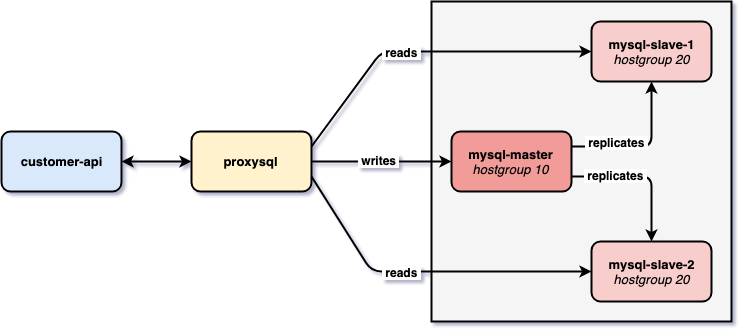

# `springboot-proxysql-mysql`

The goal of this project is to use [`ProxySQL`](https://proxysql.com/) to load balance requests from a Spring-Boot
application to [`MySQL`](https://www.mysql.com/) Replication Master-Slave Cluster.

## Environment Architecture



### MySQL

[`MySQL`](https://www.mysql.com/) is the most popular Open Source SQL database management system, supported by Oracle.
In this project, we set a *MySQL Replication Master-Slave Cluster* that contains three MySQL instances: one master and
two slaves. In the replication process, the data is copied automatically from master to the slaves.

### ProxySQL

[`ProxySQL`](https://proxysql.com/) is an open-source, high-performance MySQL proxy server. It seats between application
and database servers by accepting incoming traffic from MySQL clients and forwards it to backend MySQL servers. In
this project, we set two hostgroups: `writer=10` and `reader=20`. Those hostgroups say to which database servers
write or read requests should go. The MySQL master belongs to the `writer` hostgroup. On the other hand, the slaves
belong to `reader` one.

### Customer Api

Spring-boot Web Java application that exposes a REST API for managing customers. Instead of connecting directly to
MySQL, as usual, the application is connected to ProxySQL. 

## Start Environment

- Open one terminal

- Inside `/springboot-proxysql-mysql` root folder run

```bash
./env-init.sh
```
> To stop and remove containers, networks and volumes type
> ```bash
> ./env-shutdown.sh
> ```

- Wait a little bit until the environment is up and running

## Check MySQL Replication

To check the replication status run
```bash
./env-check-replication-status.sh
```

You should see something like
```bash
mysql-master
------------
mysql: [Warning] Using a password on the command line interface can be insecure.
File    Position        Binlog_Do_DB    Binlog_Ignore_DB        Executed_Gtid_Set
mysql-bin.000003        945                     38f50e33-7fc4-11e9-a810-0242ac1b0003:1-9

mysql-slave-1
-------------
mysql: [Warning] Using a password on the command line interface can be insecure.
*************************** 1. row ***************************
               Slave_IO_State: Waiting for master to send event
                  Master_Host: mysql-master
                  Master_User: repl
                  Master_Port: 3306
                Connect_Retry: 60
              Master_Log_File: mysql-bin.000003
          Read_Master_Log_Pos: 945
               Relay_Log_File: 5c42804f49ab-relay-bin.000003
                Relay_Log_Pos: 1158
        Relay_Master_Log_File: mysql-bin.000003
             Slave_IO_Running: Yes
            Slave_SQL_Running: Yes
                            ...

mysql-slave-2
-------------
mysql: [Warning] Using a password on the command line interface can be insecure.
*************************** 1. row ***************************
               Slave_IO_State: Waiting for master to send event
                  Master_Host: mysql-master
                  Master_User: repl
                  Master_Port: 3306
                Connect_Retry: 60
              Master_Log_File: mysql-bin.000003
          Read_Master_Log_Pos: 945
               Relay_Log_File: d08e85c4beb8-relay-bin.000003
                Relay_Log_Pos: 1158
        Relay_Master_Log_File: mysql-bin.000003
             Slave_IO_Running: Yes
            Slave_SQL_Running: Yes
                            ...
```

## Check ProxySQL configuration

- Run the script below to connect to `ProxySQL` command line terminal
```bash
./proxysql-admin.sh
```

- In `ProxySQL Admin> ` terminal run the following command to see the mysql servers 
```bash
SELECT * FROM mysql_servers;
```

- The following select shows the global variables
```bash
SELECT * FROM global_variables;
```

## Start Application

- In a terminal, inside `springboot-proxysql-mysql`, run
```bash
./mvnw clean spring-boot:run
```

- The application Swagger website is http://localhost:8080/swagger-ui.html

## Simulation

1. Open three terminals: one for `mysql-master`, one for `mysql-slave-1` and another for `mysql-slave-2`

2. In terminal, connect to MySQL command line terminal running in `mysql-master` Docker container
```bash
docker exec -it mysql-master mysql -u root -psecret --database=customerdb
```

3. Do the same for `mysql-slave-1`...
```bash
docker exec -it mysql-slave-1 mysql -u root -psecret --database=customerdb
```

4. ... and `mysql-slave-2`
```bash
docker exec -it mysql-slave-2 mysql -u root -psecret --database=customerdb
```

5. Inside each one of the MySQL terminals, run the following commands to enable MySQL logs
```bash
SET GLOBAL general_log = 'ON';
SET global log_output = 'table';
```

6. The `SELECT` below is the one we will use to check the SQL command (`select`, `insert`, `update` and/or `delete`)
processed
```roomsql
SELECT event_time, command_type, SUBSTRING(argument,1,250) FROM mysql.general_log \
WHERE command_type = 'Query' AND (argument LIKE 'insert into customers %' OR argument LIKE 'select customer0_.id %' OR argument LIKE 'update customers %' OR argument LIKE 'delete from customers %'); 
```

7. Let's create a customer
```bash
curl -i -X POST http://localhost:8080/api/customers \
  -H 'Content-Type: application/json' \
  -d '{"firstName": "Ivan", "lastName": "Franchin"}'
```

8. If you run the `SELECT` described in the **step 6.** inside `mysql-master` terminal, you should see
```roomsql
+-------------+--------------+---------------------------------------------------------------------------+
| event_time  | command_type | SUBSTRING(argument,1,250)                                                 |
+-------------+--------------+---------------------------------------------------------------------------+
| 2019-05-... | Query        | insert into customers (first_name, last_name) values ('Ivan', 'Franchin') |
+-------------+--------------+---------------------------------------------------------------------------+
```

9. Let's call the `GET` endpoint to retrieve `customer 1`
```bash
curl -i http://localhost:8080/api/customers/1
```

10. If you run the `SELECT` described in the **step 6.** in one of the slaves, you will see
```roomsql
+-------------+--------------+-------------------------------------------------------------------------------------------------------------------------------------------------------------------+
| event_time  | command_type | SUBSTRING(argument,1,250)                                                                                                                                         |
+-------------+--------------+-------------------------------------------------------------------------------------------------------------------------------------------------------------------+
| 2019-05-... | Query        | select customer0_.id as id1_0_0_, customer0_.first_name as first_na2_0_0_, customer0_.last_name as last_nam3_0_0_ from customers customer0_ where customer0_.id=1 |
+-------------+--------------+-------------------------------------------------------------------------------------------------------------------------------------------------------------------+
```
> Note. Just one slave should processed it.

11. Let's `DELETE` the `customer 1`
```bash
curl -i -X DELETE http://localhost:8080/api/customers/1
```
> Note. During this delete, Hibernate/JPA does a select before performing the deletion of the record. So, you should
see another select in one of the slaves

12. Running the `SELECT` described in the **step 6.** inside the `mysql-master` terminal, you should get
```roomsql
+-------------+--------------+---------------------------------------------------------------------------+
| event_time  | command_type | SUBSTRING(argument,1,250)                                                 |
+-------------+--------------+---------------------------------------------------------------------------+
| 2019-05-... | Query        | insert into customers (first_name, last_name) values ('Ivan', 'Franchin') |
| 2019-05-... | Query        | delete from customers where id=1                                          |
+-------------+--------------+---------------------------------------------------------------------------+
```

## References

- https://github.com/sysown/proxysql/wiki
- https://github.com/sysown/proxysql/wiki/ProxySQL-Configuration
